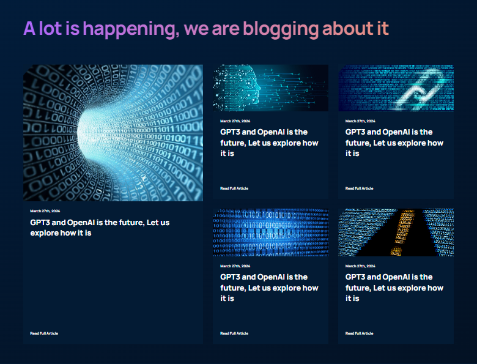

# GPT-Land React SPA

   
`try it live` [GPT-Land LIve ](https://gpt-land.netlify.app/)
  

## Skills practiced in this project

- ### React Functional Components an their usability
- ### React Folder and File structure best practices
- ### CSS Flex & Grid
- ### CSS BEM Model
- ### CSS Animations
- ### Media queries for smooth responsiveness on all devices
- ### Deployment to Netlify
- ### Transform a Figma design to a live React Application   

## Beautiful Design

   

## Integrated with a blog section

    

## Built with @vite/React

Currently, two official plugins are available:

- [@vitejs/plugin-react](https://github.com/vitejs/vite-plugin-react/blob/main/packages/plugin-react/README.md) uses [Babel](https://babeljs.io/) for Fast Refresh
- [@vitejs/plugin-react-swc](https://github.com/vitejs/vite-plugin-react-swc) uses [SWC](https://swc.rs/) for Fast Refresh
